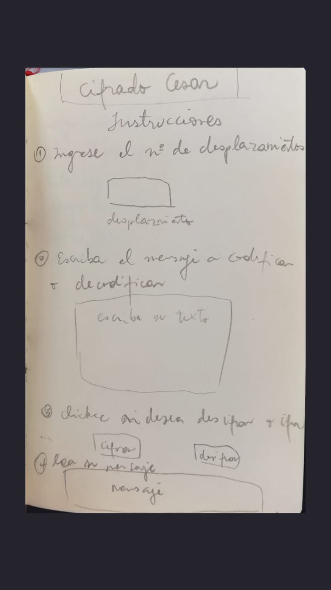
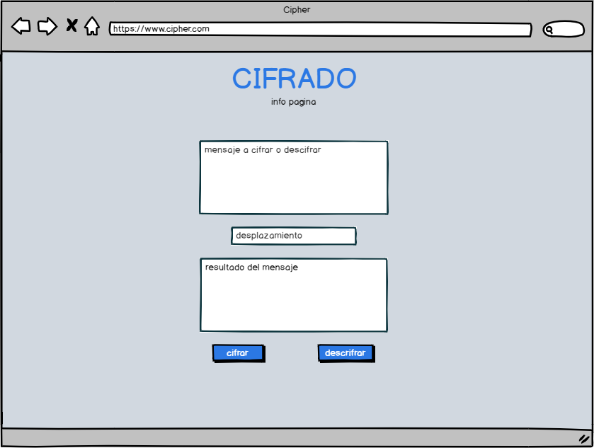
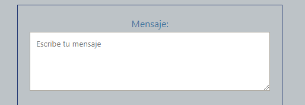
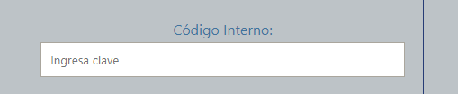
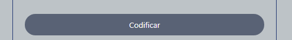
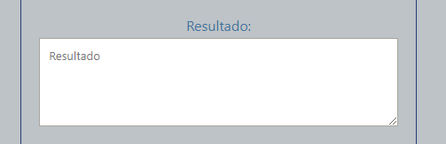

# README

## Principales Usuarios del Producto:
Los principales usuarios de mi producto son **reporteros** o **periodistas** que estan investigando alguna situación complicada, y en donde solo ellos y las personas involucradas en la investigación (editoriales o agencias de comunicación) tengan acceso a la información para evitar que se filtre manteniendo de esta manera que la información  sea lo más fidedigna posible.

## Objetivos de los usuarios en relación con el producto:
Los objetivos de los usuarios en relación con el producto es proteger la información y las cronicas que se hacen de alguna investigación en particular, teniendo solo acceso a este contenido las personas o entidades que esten a cargo de recopilar la información para luego darla a conocer o progerla. Esto aplicaria en lugares donde claramente no hay libertad de expresión o de prensa, o hasta en zonas de conflicto donde se supone que existe este derecho pero no se respeta.

## El producto está resolviendo sus problemas:
Debido a que vivimos en tiempos donde hay mucha información, existen medios informativos que dan noticias en relación a esconder o proteger intereses económicos, en este caso, los medios independientes se hacen muy necesarios, en son de proteger investigaciones y a los periodistas de los reportajes que se esten llevando a cabo, pienso que resguardar el contenido hasta que se lancen las publicaciones o se resuelvan investigaciones es de suma importancia en estos tiempos de contingencia nacional e internacional.

## Info sobre proceso y decisiones de diseño:
Primeramente me inspiré en el traductor google, por su simpleza y facilidad de entender y usar la página, pero ya que mi web está orientada a **periodistas** (que por lo general escriben bastante en el área del texto), quise darle protragonizmo a la primera caja de texto para que se sienta más cómodo a la hora de escribir o trasladar el texto desde otro documento. Por esto mismo es que mi formulario es vertical, para que a la hora de ir ingresando los datos a las distintas cajas, sea más intuitivo para los usuarios ir completandolas de esta manera.

En cuanto a los colores, implemente una paleta cromatica de _azules agrisados_ en sus distintas tonalidades, para que la página web fuera lo más sobria posible ya que principalmente es de uso profesional. Con los colores en general, aplique una combinación entre la figura del formulario y el fondo, es decir, una combinación de colores que favorezca el contraste y que no impida, ni distraiga la lectura o la visulización de los contenidos. 

La fuente que use es _Segoe UI_, porque está optimizada para legibilidad, fue desarrollada por microsoft así que puede mantener su estilo en la mayoría de los sistemas operativos de windows.

## Bocetos preliminares:
Este fue el primer boceto a mano alzada, en donde a grandes rasgos definí el orden de las cajas.

Y con en este prototipo de baja fidelidad en balsamiq pude visualizar más concretamente como se veria la web en cuanto a colores y orden de los elementos.

## Instrucciones de uso:
Para ejecutar Cipher, primero debes ingresar un texto que quieras codificar en el primer área de _Mensaje_ donde dice **"Escribe tu mensaje"**.

Luego en el área de _Código Interno_ ingresar una clave en **"Ingresa clave"**, equivalente al número de letras que quieres que se mueva el abecedario al cifrar, 

y finalmente presionar el boton **"Codificar"** 

 

para obtener el texto cifrado en la segunda caja de texto de nombre **"Resultado"**.

Para poder descifrar un mensaje es el mismo procedimiento, pero con la diferencia de que importante es saber de antemano el **"Código Interno"** ya que gracias a este número podrás obtener con exito el texto descifrado presionando el boton **"Decodificar"**,

donde el mensaje ya decifrado aparecera nuevamente en la caja de **"Resultado"**.

## Conclusión
Según las pruebas de usabilidad, que solamente pude llevar a cabo con mis compañeras, pude corregir algunas cosas que no se entendían bien en un principio, como era la pequeña descripción de la página web que se confundia con el logo, además de los colores iniciales que no iban muy acuerdo a lo que queria comunicar, por lo demás me pude dar cuenta de que la web es intuitiva en el orden que debemos ir completando los campos para poder cifrar. Finalmente, no alcancé a realizar test de usabilidad con usuarios reales, los que sin duda me hubieran servido para sacar más conclusiones sobre la aplicación.

## Esta página web fue construida con:
- html
- css
- javascript

## Autores:
- Tamara Muñoz 

